# Discord Installation, Setup, and Usage
At a basic level, Discord is an instant messaging service with video and audio capabilities similar to Skype, Teams, Google Groups, Slack, and many others. What sets Discord apart is the ability to create discrete communities distinct from others. 

For example, Python has its own community, or *server*, where people gather to discuss all things Python as well as receive help from random people. You can find servers for any community like NFL Draft, Fantasy Premier League, Bundesliga, Minecraft, Xbox, all types of music, Tesla Motors, and science and tech.

If you have a favorite subreddit you subscribe to, chances are it has a Discord server. Typically, the link to that Discord server is provided by the subreddit. While Discord has its roots in gaming, it has grown to encompass a broader range of topics.

## Installing Discord, Creating Account, Setting Up App
Download the [Discord client](https://discord.com/download). Create your account. You do not need to use your University email address to setup an account. If you have an existing account, go ahead and use that. 

After creating your account, be sure to verify your account by opening the email Discord sent and clicking the provided link.

Prior to joining the course server, there are a few housekeeping items you should perform in the `Settings`:
1. Setup Two-Factor Authentication: This website provides instructions for setting up 2FA using the desktop client, iOS, or Android: [Setup Two-Factor Authentication](https://support.discord.com/hc/en-us/articles/219576828-Setting-up-Two-Factor-Authentication). You will need to scroll down the page to find the system you are using.
1. Setup [Privacy & Safety](https://discord.com/safety/360043857751) for your account. Under the section `Who Can Add You As a Friend` be sure to enable `Server Members` if you would like to direct message myself or the TAs; otherwise, we will not be able to.
1. Confirm `Voice & Video` settings are correct. If you would like to use `Push to Talk`, which is similar to what Zoom uses, then be sure to enable that option.
1. Confirm the following in `Notificatons` for the desktop client:
   1. Enable the option `Enable Desktop Notification`
   1. Enable the option `Enable Unread Message Badge`
   1. Optional, enable and set `Push Notification Inactive Timeout`
   1. Confirm selections for `Email Notifications`
1. Setup the startup behavior of the desktop client under `Windows Settings`
1. Confirm your selections under `Activity Status`; you may not have any options here if you are new to Discord

If you installed the mobile version, be sure to look through the settings to confirm the behavior of the application.

## Joining the Course Server
I recently emailed you an invitation link to the class Discord server. Please click on that link now to join. 

Once joined, review the channels `#welcome`, `#rules`, and `#roles`. Once done, you will need to change your nickname for the class server in order for us to identify you. 

For mobile, perform the following:
* Swipe from right to left until you see a list of names (the `Member List`), touch your name 
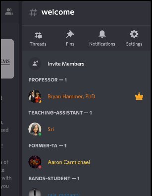
* Touch your profile in the list, which snaps a profile snippet on screen 
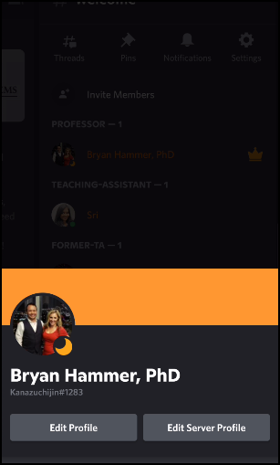
* Select `Edit Server Profile` and update your nickname; this only applies to the course server
* Once done, hit the `back` arrow; you should confirm the nickname change

On desktop, perform the following:
* Find your name on the right-hand side in the `Member list` and click on it
* If you do not see the `Member List`, click on the button at the top that looks like the silhouette of two people
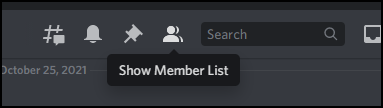
* After clicking your profile name in the list, a window opens with your profile; click on the link `Edit Server Profile`
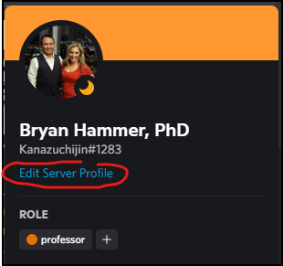
* Update your nickname and click `Save`; your name should be updated

You can now request a role on the server. This will give you access to the channels in the various categories. Follow the instructions in the channel `#roles` to request a role.

## Navigating Discord
Discord uses a modern method for organizing chat rooms, similar to Teams and Slack. A channel is dedicated to a specific topic. Channels are typically (but not always), grouped into `Categories`.

Look at the image below. The following categories are visible:
* `Rules and Information`
* `Professors and TAs`
* `Announcements`

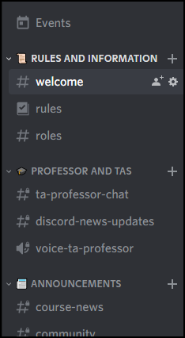

Under the category `Rules and Information` the following channels are available:
* `#welcome`
* `#rules`
* `#roles`

Notice most channels have a hashtag `#` preceeding the name. This indicates these channels are text. 

Channels with a volume icon  are voice channels, useful for speaking to someone else.

You can use hotkeys to navigate quickly through channels, categories, members' messages, and servers.
* [Windows Hotkeys](https://support.discord.com/hc/en-us/articles/225977308--Windows-Discord-Hotkeys)
* [Mac Hotkeys](https://support.discord.com/hc/en-us/articles/225878307--macOS-Discord-Hotkeys)

## Updating Notifications
Managing the settings of notifications is important for Discord. This is especially true if you are a member of multiple servers. You do not want to become inundated with multiple notifications (unless you want to). 

You can configure notifications at the server level, category level, or channel leve. Personally, I like to configure notifications at the category level if it is a server I engage in frequently. If I rarely participate in a server, I simply mute it.

To mute a server in the desktop client, right-click on the logo, navigate to `Mute Server`, then click `Until I turn it back on`. That will permanently mute the server.

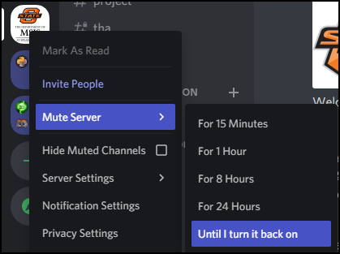

On mobile, long-press the server logo, select `Notifications`. At the top you will see something similar to what is below.

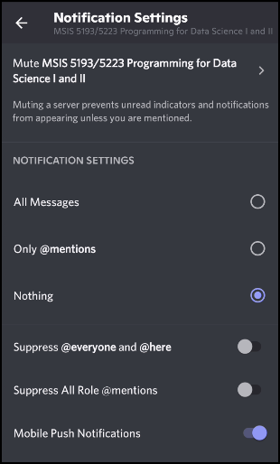

Select the top option to bring up the context menu for muting the server.

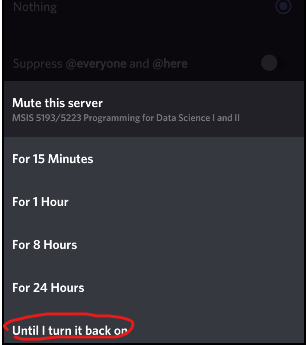

Controlling notification settings at the category level provides more ganular control. In mobile, long-press the category to open the context menu and select `Notification Settings`. You have the following options:
* `All Messages` - You will receive notifications for any message posted in any channel under this category
* `Only @mentions` - You will receive notifications when someone `@` mentions your nickname
* `Nothing` - You will not receive any notifications

The desktop app differs here. You cannot access category-level settings by right-clicking the category name. Instead, click on the server name as shown below. Next, select `Notification Settings`.

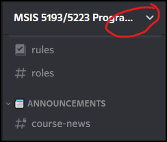

You should now see familiar options now. Scroll down until you see `Notification Overrides`. In the drop-down menu with the text `Select a channel or category...`. Select the category `📰 Announcements`. Then select the option `All`. This will allow you to receive a notification anytime an message is posted in any channel under the category `📰 Announcements`.

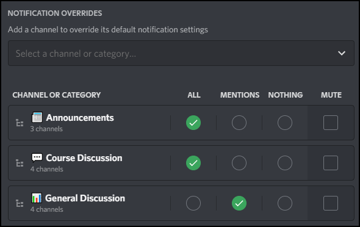

I recommend you do this for `Course Discussion` as well. This way, when another student asks a question, or I post a clarification about an assignment, you will receive notification.

## Discord Markdown
Formatting can make a big difference in how text appears. This is especially true when you are seeking help for homework. Look at the two examples below. Which one is easier to read?

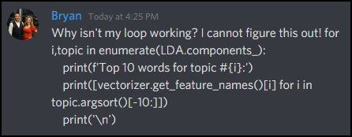

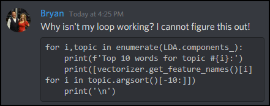

Obviously, the second option. By using the markdown for multi-line blocks of code, the Python code is easy to discern.

Discord has a dedicated webpage for illustrating [markdown](https://support.discord.com/hc/en-us/articles/210298617-Markdown-Text-101-Chat-Formatting-Bold-Italic-Underline-).

Another important aspect of writing a chat message is creating a new line. By default, when you press `Enter`, your message is sent. If you want to create a new line in your message, how do you do that without sending the message? Simply use `Shift+Enter`.

## Audio and Video

If you are experiencing problems with voice or video, use this [Discord Troubleshooting Guide](https://support.discord.com/hc/en-us/articles/360045138471-Discord-Voice-and-Video-Troubleshooting-Guide).