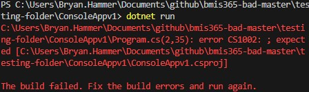
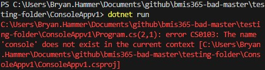
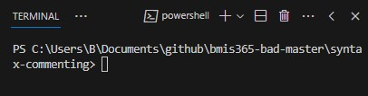
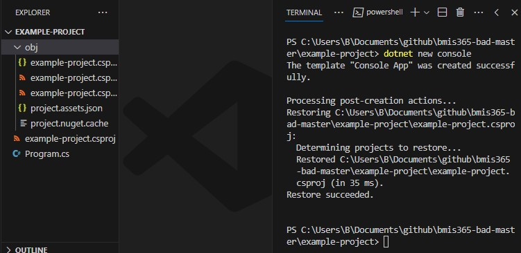
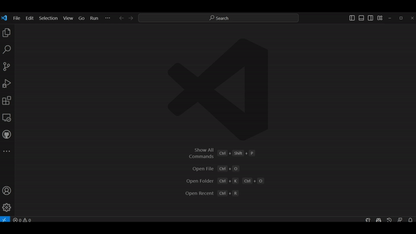
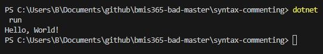

# Introduction to Syntax and Commenting
In this module you will learn about syntax in C#. You will also learn how to start a new project in C# using Visual Studio Code.

## Turn on Autosave
If you have not already, I highly recommend you turn on the auto-save feature in VS Code. Navigate to the menu and select `File` and click `Auto Save`. That is it! This will prevent you from losing code because you forgot to save your workspace.

## Syntax of C#
All programming languages have their own nuanced way of writing code. The rules, structure, and organization of C# is the syntax. Just like spoken languages have syntax (e.g., rules and structure), programming languages do as well. In this section I will cover various aspects of syntax for C#.

### The semicolon ;
Like most programming languages, a line represents a specific segment of code you want executed. How does a programming language know when a line ends? Several languages, such as C, C++, Java, and C# rely on the semicolon `;`. Placed at the end of the line, the semicolon `;` informs C# that the code ends. Other programming languages, such as Python, do not use a semicolon.

Here is what that looks like:

```C#
// Some code for demonstration
Console.WriteLine("My cabbages!");
```

If I leave off the semicolon, I will run into problems:

```C#
// Some code for demonstration
Console.WriteLine("My cabbages!")
```



The error message returned provides important information. First, we are told which row and column the error originated from `(2,35)`. The first number is the line followed by the column. Thus, line 2 and column 35. Line 1 is a comment, with the actual code on line 2. Second, the error states

> error CS1002: ; expected

The error is telling us a semicolon is expected.

### Indentation
Indentation often ends up as a phiolosphical debate for late nights over drinks because it is not strictly necessary. What I mean by this is that your program will run just fine without indentation. Many programming languages do not require indentation to demarcate or clarify a block of code (e.g., C++, Java) while others rely on indentation to demarcate these blocks (e.g., Python). In languages like C#, curly brackets, or braces, are used to designate blocks of code. Yet, I can still rely on indentation to visually clarify my code.

Here is an example:

```C#
int x = 20;
int y = 18;
if (x > y) 
{
Console.WriteLine("x is greater than y");
}
```

I have an if-statement toward the bottom of the code comparing the variables `x` and `y`. The curly brackets come after the if-statement. If the if-statement is true, then the code inside the braces is executed. I can change the code slightly to provide aid visually:

```C#
int x = 20;
int y = 18;
if (x > y) 
{
    Console.WriteLine("x is greater than y");
}
```

I have used the `tab` key to indent the line of code `Console.WriteLine("x is greater than y");`. So far as C# is concerned, the two blocks of code are the same. Nothing has changed for the computer. For me, on the other hand, the code is easier to parse. Imagine a page of code over 200 lines! The indentation provides my eyes less stress from parsing line after line.

As a convention, indentation is typically used between curly brackets. This is just convention, so not a rule for C#.

### Empty lines
Empty lines are treated as nothing in C#. They are not executed and are ignored. Like indentations, empty lines are not for the computer but for us. Like indentations, they provide ease of use and readability of code.

Let's take the code above and apply some empty lines:

```C#
int x = 20;
int y = 18;

if (x > y) 
{
    Console.WriteLine("x is greater than y");
}
```

I can see a clear delineation between my variables and my if-statement. Reading through this is simpler and provides more clarity. In fact, I can add comments to increase clarity:

```C#
// Variables for comparison
int x = 20;
int y = 18;

// Compare the variables using if
if (x > y) 
{
    Console.WriteLine("x is greater than y");
}
```

### Case sensitivity
So far the the discussion on syntax has focused on enhancements to C# for programmers. These are considered optional. One important aspect of syntax *that is not optional* is case sensitivity. Many programming languages are case sensitive. That is, certain code has to be written with case in mind. Let's look at an example.

```C#
// Some code for demonstration
Console.WriteLine("My cabbages!");
```

The code above is written correctly and will execute without issue. Yet, if I change one of the upper case letters...

```C#
// Some code for demonstration
console.WriteLine("My cabbages!");
```



Often, when a student encounters an error in their code, as a novice, the two main culprits are incorrect case and leaving off a semicolon. Please remember both of these!

## Commenting in C#
An important tool in your arsenal is commenting. You can use commenting to explain code, temporarily block code from running as you test alternatives, or as a reminder. C# utilizes two styles of commenting:
* Single-line commenting: Used for commenting a single line of code.
* Multi-line commenting: Used for commenting on multiple lines of code.

### Single-line commenting
To create a comment, you simply use `//` at the start of a line. Anything placed after `//` will not execute. Only you, as the coder, will see that line of code while the file is open. Here is an example.

```C#
// I like to eat potatoes with butter, salt, and pepper.
Console.WriteLine("Hello World");
// Console.WriteLine("Hello World");
```

The above code contains two commented lines. The top line is just text. That text will not output or otherwise run. It's just a note to myself about how I like my baked potatoes.

The second line of code outputs the text `Hello World`. This line executes. The line below it will not execute. Even though the text is similar, because of the two forward slashes `//`, C# interprets it as a comment.

You can also place a single-line comment after code like so:

```C#
// I like to eat potatoes with butter, salt, and pepper.
Console.WriteLine("Hello World"); // Saying hello to the world.
// Console.WriteLine("Hello World");
```

### Multi-line commenting
Multiple line commenting, or comment blocks, provide the ability to write comments over multiple lines. This can be useful if you have very complex code that needs an explanation. Or, if you want to block out a section of code and prevent it from running. I use this frequently. Sometimes, I am stuck on some code and need to start fresh. I do not want to remove my existing code, so I just block out the problematic lines.

To create multi-line comments, simply start with `/*` and end with `*/`. Any text between those C# ignores. Here is an example:

```C#
/* ================
Web scraping program, using Selenium, used to pull
information from Moodle. The following code finds
the HTML for the username text field and the button
to provide credentials for logging in.
*/ 
IWebDriver driver = new ChromeDriver();
driver.Navigate().GoToUrl("https://moodle.umt.edu");
var title = driver.Title;
driver.Manage().Timeouts().ImplicitWait = TimeSpan.FromMilliseconds(500);
var textBox = driver.FindElement(By.Id("username_fld"));
var submitButton = driver.FindElement(By.Name("_eventId_proceed"));
```

Do not stress out about the code above. Just observe the comments in action. I wrote descriptive text about the code I just wrote. This provides future me (as well as others) an understanding of the purpose of the code.

### Tying it together
I can take the previous body of code and improve upon it by adding single-line comments to clarify my code:

```C#
/* ================
Web scraping program, using Selenium, used to pull
information from Moodle. The following code finds
the HTML for the username text field and the button
to provide credentials for logging in.
*/ 
IWebDriver driver = new ChromeDriver(); // Use Chrome as the web browser
driver.Navigate().GoToUrl("https://moodle.umt.edu"); // Using Chrome, navigate to the Moodle website
var title = driver.Title; // Capture the title of the webpage
driver.Manage().Timeouts().ImplicitWait = TimeSpan.FromMilliseconds(500); // Wait 500 milliseconds for the webpage to load, in case the Internet is running slow today
var textBox = driver.FindElement(By.Id("username_fld")); // Find the username textbox
var submitButton = driver.FindElement(By.Name("_eventId_proceed")); // Find the submit button on the webpage
```

If the code is causing me issues and I want to start over, rather than deleting all of the code, I can just wrap it in a multi-line comment block:

```C#
/* ================
Web scraping program, using Selenium, used to pull
information from Moodle. The following code finds
the HTML for the username text field and the button
to provide credentials for logging in.
*/ 
/* =====Save this code for reference=====
IWebDriver driver = new ChromeDriver(); // Use Chrome as the web browser
driver.Navigate().GoToUrl("https://moodle.umt.edu"); // Using Chrome, navigate to the Moodle website
var title = driver.Title; // Capture the title of the webpage
driver.Manage().Timeouts().ImplicitWait = TimeSpan.FromMilliseconds(500); // Wait 500 milliseconds for the webpage to load, in case the Internet is running slow today
var textBox = driver.FindElement(By.Id("username_fld")); // Find the username textbox
var submitButton = driver.FindElement(By.Name("_eventId_proceed")); // Find the submit button on the webpage
*/

// New code here
IWebDriver driver = new ChromeDriver();
driver.Navigate().GoToUrl("https://moodle.umt.edu");
var title = driver.Title;
```

## Creating and Running a New C# Project
When you create a C# program, it is referred to as creating a project. You can approach this a few ways, but they all require you to open a folder in VS Code. If you are using a repository from GitHub, pull your repository from GitHub first, then open up the folder in Visual Studio Code. If you want to create the project first and then push it to GitHub as a new repo, then open VS Code and select an empty folder.

### Using the terminal
One of the simplest ways to create and run a project in VS Code is using the terminal. The next step is to open up the terminal in VS Code (by default it should be PowerShell). You can open the terminal inside VS Code several ways. The first way (and my personal favorite) is by using the shortcut key: `` CTRL+` ``. Alternatively, you can navigate to the menu and select `View` then `Terminal`.

Once open, you should see a terminal or command line as shown below in the screen capture.



In the terminal, type in the following command and execute it by pressing the `Enter` key:

```PowerShell
dotnet new console
```

Please see my animated gif below for what this looks like and the resulting files created.


This should result in several new files and a new directory as shown here:



### Using VS Code's Command Palette
The Command Palette is 
1. Open the Command Palette by using the shortcut keys `Ctrl + Shift + P`.
1. Find and select the `.NET: New Project` command by typing it.
1. After selecting the command, you'll need to choose the project template. Choose `Console app`.
1. Name the app by typing in a descriptive name.
1. Select the directory to create the files; the default is perfectly acceptable.



### Running the program
To run this program, you will need to execute the following code in the terminal:

```PowerShell
dotnet run
```



While you have options and shortcuts to run the program using the menu in VS Code or the debugger, just keep in mind this is a little more complex and we will discuss this later.