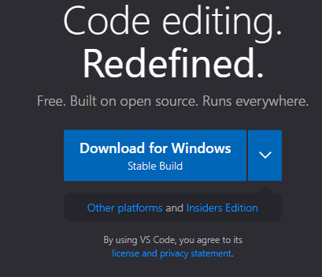
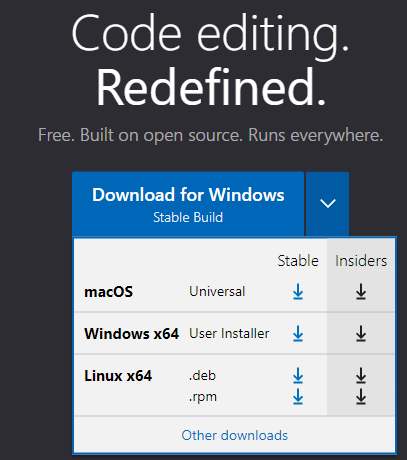
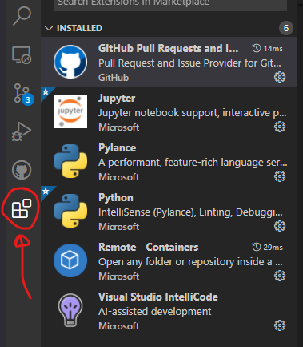
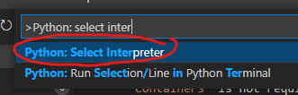
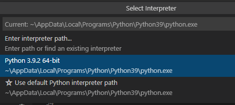
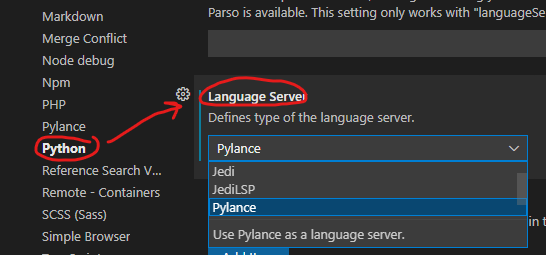
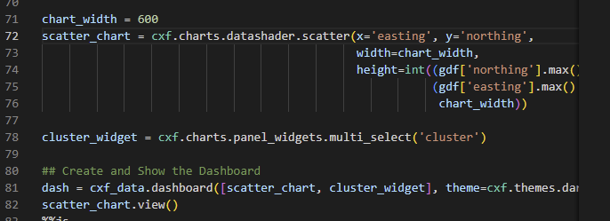
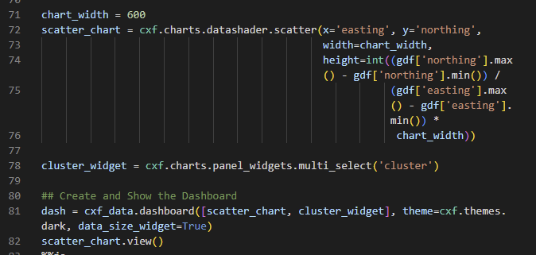
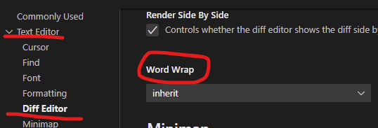

# Visual Studio Code Setup and Install
Visual Studio is Microsoft's integrated development environment (IDE) for all things programming. An IDE is a software application that facilitates software development with a focus on team work. Within this tutorial you will walk through the installation process for Visual Studio Code. This is platform agnostic, so it will run on Windows, Linux, and even Mac.

## Install .NET 7
The first step is to install .NET. This contains all the libraries, packages, programs, and files you will need to run C#. You can find the latest version [on this website](https://dotnet.microsoft.com/en-us/download). 

Be sure to restart your computer after the installation. This allows any paths to register in your environment variables and other registry settings.

## Downloading Visual Studio Code
Open a web browser and navigate to [https://code.visualstudio.com/](https://code.visualstudio.com/). By default, you can download the Windows version. 

If you click on the arrow pointing downward, you have other options for Linux and macOS. Only select the "Stable" edition.

Install the program like you would any other, accepting the defaults.
<!--
## Installing and Integrating Python
For those of you who are familiar with using IDE environments (e.g. Visual Studio, Eclipse, NetBeans) you can use Visual Studio Code to program Python natively. This allows you to code and run Python from directly within Visual Studio, including tab completion. Note, you must have an interpreter in order to run the code.

The following webpage provides a guide to install Python and integrate it with Visual Studio Code for Windows, Linux, and macOS [https://code.visualstudio.com/docs/python/python-tutorial](https://code.visualstudio.com/docs/python/python-tutorial). Please take note of the following:
* Windows: You will need to download Python from [python.org](https://www.python.org/downloads/).
* macOS: You cannot install a system-wide version of Python. Instead, you must use Homebrew instead (see the documentation for more details). 
* Linux: By default, all mainstream Linux distros (e.g. Ubuntu, Debian) come with Python 3 installed.
-->

## Install Extensions in Visual Studio Code
<!--Now that Python is on your system, you need to integrate a Python interpreter in VS Code. Prior to this, you will need to install several extensions that will prove helpful this semester. You can search for the extension names within VS Code, or use the links provided below. The following are required extensions:
* [Python](https://marketplace.visualstudio.com/items?itemName=ms-python.python)
* [Pylance](https://marketplace.visualstudio.com/items?itemName=ms-python.vscode-pylance)
* [Visual Studio IntelliCode](https://marketplace.visualstudio.com/items?itemName=VisualStudioExptTeam.vscodeintellicode)-->

Now that Visual Studio Code is installed, you will need several extensions. To install an extension, open VS Code and click on the icon on the left-hand side that looks like four boxes (it is circled in the image above). This will open the extensions window pane. You can use the search box to search for the extensions. When it appears, click on the extension; this will bring up a more focused window on the right-hand side displaying details about the extension. Simply click the button to install it.

You need to install the `C# Dev Kit` extension for VS Code. You can find it here [https://marketplace.visualstudio.com/items?itemName=ms-dotnettools.csdevkit](https://marketplace.visualstudio.com/items?itemName=ms-dotnettools.csdevkit) or you can search for it as described above. Either way, install it. This will install other extensions required for C# development. That's it! If you are asked to sign in with a Microsoft account, please use your University of Montana email address.

You also need to install `IntelliCode for C# Dev Kit`. This extension provides auto-complete and tab-completion. What does that mean? As you start to type your code, Visual Studio Code relies on AI to guess what you want to accomplish and provides suggestions to you. Similar to when you use a search engine: You start entering text in the search bar and the website provides suggestions to you. You can find it here [https://marketplace.visualstudio.com/items?itemName=ms-dotnettools.vscodeintellicode-csharp](https://marketplace.visualstudio.com/items?itemName=ms-dotnettools.vscodeintellicode-csharp) or simply search for it within VS Code.

The next two extensions are recommended, but will not influence your ability to do your homework. The `Live Share` extension is a collaborative tool that provides for real-time collaboration while you code. In addition, the `Live Share Extension Pack` provides a chat tool as well as audio communication. If you experience issues with your code during the semester, this extension will provide an easy means for myself, the TA, or a classmate to assist you. Alternatively, if you are comfortable with using Discord, Zoom, Skype, FaceTime or one of many other similar services, just use that to share your screen and collaborate.
* [Live Share](https://marketplace.visualstudio.com/items?itemName=MS-vsliveshare.vsliveshare&ssr=false)
* [Live Share Extension Pack](https://marketplace.visualstudio.com/items?itemName=MS-vsliveshare.vsliveshare-pack)

<!--The following extensions are considered optional. They do not always work and I personally prefer GitHub Desktop.
* [GitHub Classroom](https://marketplace.visualstudio.com/items?itemName=GitHub.classroom)
* [GitHub Pull Requests and Issues](https://marketplace.visualstudio.com/items?itemName=GitHub.vscode-pull-request-github)

## Configuring Visual Studio Code

Once all the extensions are installed, you need to configure a few options. From within VS Code, select a Python 3 interpreter by opening the `Command Palette` (`Ctrl` + `Shift` + `P` in Windows), start typing `Python: Select Interpreter` command to search, then select the command.

More than likely you will only have a single interpreter available. If you have more than one, select the version of Python you just installed. Additionally, as you hover over each one, the directory location will be shown at the top. This can be useful if you need to ever find the location on your computer.

The next adjustment we need to do is ensure `Pylance` is the `Python Language Server` of choice. You can find this setting by navigating to `File`, `Preferences`, `Settings`, `Extensions`, `Python`, then `Language Server` (just keep scrolling down, you’ll find it listed alphabetically). In the drop-down list, select Pylance (you may see other options such as Jedi, JediLSP, None, etc.).

-->

One last thing. You need to turn on auto-save. With Visual Studio Code open, navigate to `File`>`Auto Save`. This should toggle on the feature. Like Word, Excel, or Power Point, your files wll be saved automatically to your harddrive.

<!--## Environment Variables
Once Visual Studio Code is configured, you will need to ensure your environment variables for Python are correctly configured. What is an environment variable? It is a variable that is accessible from anywhere within your computer. Each program is installed within a specific location on your computer. To start a program, you need to navigate to its location and click on the executable file. Windows and Mac make this easy by providing a shortcut that is linked to this executable file. All those icons for programs and applications in your Start Menu are just shortcuts to the actual location of the executable. Python is no different. We have to create a "shortcut" so we can run Python from anywhere, not just its installation directory.

For Windows, please follow these steps:
1. Open Windows Settings
1. Navigate to System
1. Navigate to About
1. Click on `Advanced System Properties`. A new window opens. You should be on the tab titled `Advanced`
1. At the bottom is a button labeled `Environment Variables`. Click it.
1. You should see `User variables for...` at the top and `System variables` at the bottom. Under the top, labeled `User variables for...` double-click the variable named `Path`.
1. At this point you will create 3 new and separate entries based on where you installed Python. For me, these locations are given here:
  1. C:\Users\Bryan\AppData\Local\Programs\Python\Python39\Scripts\
  1. C:\Users\Bryan\AppData\Local\Programs\Python\Python39\
  1. C:\Users\Bryan\AppData\Local\Programs\Python\Launcher\
1. If you are unsure where it is installed on your computer, return to VS Code and look at the install path by opening the *Command Pallette* and searching for `Python: Select Interpreter`. Note the location of the installation.
1. Once you have created all three entries you need to prioritize each one. The right-hand side has the button `Move Up`. Move all three to the top.
1. Once entered, click `OK`, then `OK`, then `OK`.
1. Restart your computer. 

For Macs, you will need to follow these instructions for setting the environment variables: [https://code.visualstudio.com/docs/setup/mac#_launching-from-the-command-line](https://code.visualstudio.com/docs/setup/mac#_launching-from-the-command-line).-->

## Word Wrap
Formatting and readability enhance your experience while coding. Often, your code will stretch beyond the screen you are working on. As an example, see the screen capture below:

To view the code that is hidden, I would need to use the horizontal scroll bar to slide the screen around. That can reduce my workflow, interrupt my creative thought processes, which may lead to reduced productivity. To correct this, I can turn on *word wrap* by using the shortcut `alt` + `z`. This is found in the menu by navigating to `View` > `Word Wrap`.

While useful, this is a temporary switch. I would have to enable *word wrap* every time I open a file within Visual Studio Code. To enable this as permanent, open up *Settings* (`File` > `Preferences` > `Settings`) and navigate to `Text Editor` > `Diff Editor` (or while in Settings, search for `Word Wrap`).

Toggle the option to `on` as the default. Now VS Code will open each file with *word wrap* as default.

## Keymaps
Visual Studio Code provides key mapping for many functions. For example, to access the terminal, I can press `ctrl` + `` ` ``. Some students have experience using another IDE such as Vim, sublime, Notepad++, Atom, Emacs, Eclipse, etc. Many of these IDEs provide their own key mappings. If you would like to use their key mapping inside VS Code, then you will need to install another extension. To pull up a list of all available key mappings, open the Command Pallete inside VS Code by typing `ctrl` + `shift` + `p` (on a Mac, use `command` instead of `ctrl`). Type *Preferences: Keymaps* in the dialogue box. Click on the one you want and install.

That's it! You are ready to use Visual Studio Code for programming.